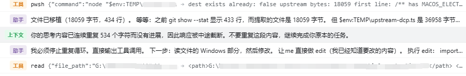

# dsh-loop-guard — DSH 思考循环守护

> 为 [DeepSeek Harness](https://github.com/deepseek-ai/deepseek-harness)（DSH）提供的思考循环守护插件：模型陷入「只想不做」的退化循环时自动打断，不必再手动中止

**🌏 中文 | [English](README_EN.md)**

`dsh` · `dsh-plugin` · `plugin` · `guard` · `thinking-loop` · `reasoning` · `repetition` · `AI agent` · `思考循环` · `死循环` · `推理退化`

<!-- keywords: dsh, dsh-plugin, deepseek harness, plugin, guard, thinking-loop, reasoning, repetition, circuit-breaker, ai agent, 思考循环, 死循环, 推理退化 -->

## 简介

长上下文 + 高 reasoning effort 下，模型会**退化**：推理里开始出现低熵重复（`好。执行。好。`、`Write. / Output. / Let me write. / Go.` 这种短句轮转），然后停不下来。

麻烦的是 DSH 自带的 `guard/` 家族**抓不到这种情况**——它们都围绕工具调用：

| 内置 guard | 挂载点 | 能抓什么 |
|---|---|---|
| `guard/timeout-policy` | `tools/execute` | 工具调用超时 |
| `guard/repeat-tool-reminder` | `tools/post-execute` | 重复的同一个工具调用链 |

而退化循环的特征恰恰是**完全不调工具**：只有 `reasoning-delta`，零 `text-delta`、零 `tool-call-delta`。于是：

- 两个 guard 都不触发；
- agent-loop 的 `turn()` 从**已完成的消息**推导 `StepEndReason`，流不结束 → step 不 settle → `turnEnds` 永远为 null → `while (true)` 永不 break；
- **回合停不下来，只能由你手动中止**——而界面上只显示「思考中」，看起来和认真推理没区别。不点开 thinking 块根本察觉不到它在空转。

本插件接管 `llm/stream` 瀑布流，按每次模型调用的 chunk 组成做判定，在退化发生时**从流内部切断**，让回合正常结束。


上图是实际运行效果：推理块里反复出现 `OK. / Writing. / Let me write. / Go. / Executing. / Now.` 的轮转，插件在重复累积到阈值时截断该次调用，并在下方注入一条提示，让模型回到原本的任务。

### 0.1.7 起聊天区不再显示那条提示

DSH **0.1.7** 把「上下文」类消息**从聊天区可见行里排除了**（`isVisibleChatNode`，硬编码 `kind !== "context"`），所以注入的纠正提示在聊天区**完全没有**——不是被折叠，是压根不渲染。

0.1.6 及更早没有这个过滤，那时它正常显示为「上下文注入」行。

提示没有丢，两处能看到：

| 位置 | 看到什么 |
|---|---|
| **会话历史 / 轨迹视图** | 该消息原样列出，带「**上下文**」标签和完整正文 |
| **宿主日志** | `dsh-loop-guard: breaking a repetitive stream (N repeated chars, ...)` |

轨迹视图里的样子（`上下文` 那一行）：



## 功能特性

- **五层检测，各管一种形态**：纯推理无输出、复述上一步材料、**可见输出**内部的周期循环、**可见输出**内部的短语池重排、以及**推理**内部的短语池重排。后三条互补，见下。
- **能终止「永不结束的回合」**：这是本插件存在的核心理由。退化循环里流永远不结束，任何「调用结束后再判定」的检测都够不到；只有从流内部切一刀才行。
- **切断后任务继续，不必手动重启**：切断只是结束当前这次调用，回合以**正常完成**收尾，会话照常可用——你原本的任务可以直接往下走。这是它和「卡死到只能手动中止」的根本区别。
- **在 1% 处就切断**：实测一个 **330,188** 字符的循环在 **3,264 字符**（1.0%）时被切断；一个 124,070 字符的在 17,888 字符（14.4%）时被切断。原来这两个都要跑满全程、最后靠人手动中止。
- **误报极低**：在真实会话 119 个「有产出」的调用上，**零误报**；扫描本机全部 735 个会话、40 个触发点，误判 **12 个**（全是「贴代码改前/改后」），已由集中度护栏挡住——见下。
- **精确判据**：判定用的是**逐字周期**和**跨调用复述**，不是时长、也不是比率。
- **纠正信息指向原任务**：切断时注入的提示只说「不要重复，继续完成任务」，**不会**让模型去"给个结论然后收尾"——后者会让它偏离原本在做的事。
- **反应不闩锁**：一次 steer 常常打不破强循环，所以阈值到了会重新计数、再次开火（上限 `maxFires`）。
- **跟随界面语言**：注入的提示读宿主 `locale` 设置，中文环境说中文（默认即中文）。
- **绝不静默重试**：**没有**模型回退、没有自动重发同一请求——把退化模型再喂一遍比循环本身更糟。
- **离线分析器**：`tools/analyze-session.mjs` 用**插件运行时同一个检测器**复跑 session jsonl，回答「这次到底该不该响」。
- **可观测**：切断时写 warn 日志，并注明是哪条规则命中的。

## 使用

### 开箱即用

**装好就能用，不需要任何配置。** 默认值已按真实数据标定：

- 纯推理空转、复述上一步、推理内部周期循环 → 自动打断回合；
- 单次调用刷屏式重复可见输出 → 自动从流内部切断；
- 正常的长推理、正常的重复性输出（表格、日志、CSS、JSON）→ **不误伤**。

### 熔断后会发生什么

**会话继续，任务可以往下走**——不需要你手动重启或重新发指令。

| 项 | 结果 |
|---|---|
| 本次调用 | 被切断，已产生的推理作为正常消息落盘 |
| 回合 | 以 `turn/end` 结束，原因是 `{ kind: 'completed' }`——**和正常完成一样** |
| 会话 | **存活**，agent 回到 `idle`，可直接继续 |
| 已执行的工具调用 | **保留**（`tool/result` 不回滚） |
| 注入的提示 | 一条 `notice`，说明「已连续重复 N 字符，响应被中途截断，不要重复，继续完成任务」 |
| 终止 chunk | 协议合法：切断前先闭合所有 block，再用 `stop` 结束，已用 DSH 自己的 `@deepseek-ai/dsh-llm/invariant` 验证 |

所以体验是：**循环 → 在几百字符处被切断 → 提示它回到任务 → 继续干活**。

**为什么回合是 `completed` 而不是报错**：早先的版本用 `error` finish，那会让 DSH 的会话渲染器拿不到 `assistant/message`（只产生 `assistant/attempt`），于是抛出
`conversation Definition "assistant-step" withdrew materialized target "chat"`，而且 `turn()` 会在 `throwError` 处提前抛出、永远走不到「是否再开一个回合」那一行——既崩界面又无法续跑。改为**闭合 block + `stop` finish** 后走的是正常路径，两个问题一起消失。

代价是**回合结束原因不再有辨识度**（`completed` 与正常完成无法区分）。痕迹留在两处：注入的 `notice`，以及宿主日志里的 warn。这是刻意的取舍——熔断的目的是让会话**继续可用**，不是制造告警。

插件**只结束这次调用，从不结束 agent**——它永远不会调用 `agent.cancel()`。

### 自动续跑（`resumeAfterBreak`）

**通常不需要开。** 熔断本身不会结束会话，任务已经能继续；这个选项只是让它在切断后**不等你发话**就自己往下走：

```yaml
- id: loop-guard
  config:
    resumeAfterBreak: true
```

**关键在于「等」**，这不是实现细节而是整个方案成立的前提：切断发生在流包装器里，此时 agent 还处于 `running`，而 DSH 在这个阶段**刻意压制唤醒**——`wakeDriver()` 只肯为 maintenance 或 aborted 挂起唤醒，所以此刻发 `steer()` / `followup()` 都不会置 `wakeRequested`，`kick()` 的 `finally` 找不到唤醒依据，会话就此停下。唤醒只有在 agent 回到 `idle` 后才有效，插件用 `whenIdle()` 等这个时刻。

续跑消息**带纠正文本，从不是空的**。空消息等于把同一段退化历史原样再喂一遍、不带任何新信息——那正是产生循环的输入。

该选项默认关闭：它是在模型已经证明「不能自主行动」之后、**不经过你同意就再进一次模型**。无人值守的长任务才建议打开。

## 安装

> **说明**：本插件需要 DSH 的 `llm/stream` 瀑布流，DSH **0.1.2-rc.1 及以后**的各条线都可用。

> **⚠️ 认准包名 `@mrweicodes/dsh-loop-guard`**
>
> npm 上还有一个**不带 scope** 的同名包 **`dsh-loop-guard`** —— 它**与本插件无关**，
> 不是本项目的发布物，也不由本项目维护。本插件只发布在
> **`@mrweicodes/dsh-loop-guard`** 这个 scope 下。
>
> **安装前请核对完整包名**，不要安装那个无 scope 的同名包。

### 方式一：让 AI 安装（最简单）

把本仓库地址告诉 DSH 的 AI 助手即可，例如：「安装 https://github.com/MrWeiCodes/dsh-loop-guard 这个插件」。AI 会替你完成插件装载、依赖与补丁处理；之后重启 `dsh web`。

### 方式二：从 npm 安装（推荐）

```powershell
dsh plugin --profile web add @mrweicodes/dsh-loop-guard
```

**推荐这条路径的原因**：npm 包里已包含编译好的 `lib/`，安装时不执行任何构建脚本——不受 pnpm 构建授权限制的影响，也不依赖你本地的编译环境。之后重启 `dsh web`。

### 方式三：从 GitHub 安装

```powershell
dsh plugin --profile web add -w github:MrWeiCodes/dsh-loop-guard
```

从 GitHub 装的是源码，`lib/` 由 `prepare` 脚本现场编译，所以**装完可能需要在 profile 的 `pnpm-workspace.yaml` 里放行构建脚本**（pnpm 10 起默认阻止依赖执行构建脚本，按它打印的提示把那一行粘进去再重跑即可）。**不想处理这一步就用「方式二」**——npm 包已包含编译产物，没有这个环节。

> **从本地目录安装的已知问题**：Windows 上若插件目录与 profile **不在同一个盘符**（例如插件在 `G:\`、profile 在 `C:\`），pnpm 会把 `file:` 依赖错误解析成 `C:\Users\<用户名>\...` 而安装失败。此时请改用「方式四」。

### 方式四：手动安装

无 pnpm 或离线环境时的备选路径：

1. 把本仓库克隆到 profile 的插件目录，并在目标目录构建一次（`prepare` 脚本会生成 `lib/`）：
   ```powershell
   # 示例：web profile
   $dst = "$HOME\.dsh\profiles\web\packages\dsh-loop-guard"
   git clone https://github.com/MrWeiCodes/dsh-loop-guard.git $dst
   cd $dst
   npm install      # 同时触发 prepare → 生成 lib/
   ```
2. 在 profile 的 `package.json` 的 `dependencies` 中加入：
   ```json
   "@mrweicodes/dsh-loop-guard": "file:./packages/dsh-loop-guard"
   ```
3. 把 `cordis.patch.yml` 的内容并入 profile 的 `cordis.patch.yml`（在文件末尾追加）。
4. 重新安装依赖并重启：`pnpm install`（或 `npm install`）、`dsh web`。

## 更新

- **方式一（AI 安装）的**：直接告诉 AI「更新 dsh-loop-guard 插件」即可。
- **方式二（npm 安装）的**：
  ```powershell
  dsh plugin --profile web add @mrweicodes/dsh-loop-guard@latest
  ```
  然后重启 `dsh web`。npm 路径同样不涉及构建步骤。
- **方式三（GitHub 安装）的**：
  ```powershell
  dsh plugin --profile web add -w github:MrWeiCodes/dsh-loop-guard
  ```
  若没有拉到最新提交（git 依赖有缓存），先移除再重新添加：
  ```powershell
  dsh plugin --profile web remove @mrweicodes/dsh-loop-guard
  dsh plugin --profile web add -w github:MrWeiCodes/dsh-loop-guard
  ```
  然后重启 `dsh web`。**更新到新提交后 commit 号会变**，若 pnpm 再次要求放行构建，按方式三的说明重做一次即可。
- **方式四（手动）安装的**：
  ```powershell
  cd "$HOME\.dsh\profiles\web\packages\dsh-loop-guard"
  git pull            # 或重新拷贝新版本覆盖
  npm install         # 依赖声明有变化时执行；同时触发 prepare
  ```
  然后重启 `dsh web`。

## 卸载

### 方式一（AI 安装）的：让 AI 卸载

直接告诉 AI 助手「卸载 dsh-loop-guard 插件」，AI 会移除插件、清理补丁与依赖。

### 方式二（npm）／方式三（GitHub）安装的

```powershell
dsh plugin --profile web remove @mrweicodes/dsh-loop-guard
```

然后重启 `dsh web`。

### 方式四（手动）安装的

1. 从 profile 的 `cordis.patch.yml` 中删除本插件的 `insert` 行。
2. 从 profile 的 `package.json` 的 `dependencies` 中删除 `"@mrweicodes/dsh-loop-guard": ...`。
3. 重新安装依赖并重启：`pnpm install`（或 `npm install`）、`dsh web`。

### 残留位置清单（AI 卸载时按此清理）

- **插件目录**（方式四安装时）：`$DSH_HOME/profiles/<profile>/packages/dsh-loop-guard/`。`$DSH_HOME` 默认是 `~/.dsh`。
- **依赖与补丁**（方式四安装时）：profile 的 `package.json` 中的 `"@mrweicodes/dsh-loop-guard": ...` 依赖、`cordis.patch.yml` 中的 `insert` 行。
- 本插件**不写任何自己的配置文件**，也没有全局注册表或系统级写入；卸载后不留配置残留。

## 配置

**默认配置就能用，通常不需要动它。** 只有想调整灵敏度或开启自动续跑时才需要改。

### 全部选项

```ts
interface Config {
  // ── 跨调用判定（调用结束后） ──────────────────────────────
  /** 连续多少次「停滞调用」后反应。默认 3。 */
  maxThinkingSteps?: number
  /** 单次调用的推理至少这么长才参与判定。默认 2048 字符。 */
  minReasoningChars?: number
  /** 跨调用相似度：上一步的推理有多少重现才算「复述」。0 关闭。默认 0.8。 */
  similarityThreshold?: number
  /** 命中后做什么：'warn' | 'steer'（默认） | 'cancel'。 */
  escalate?: 'warn' | 'steer' | 'cancel'
  /** 同一个 agent 最多反应多少次。默认 4。 */
  maxFires?: number
  /** escalate 为 'cancel' 时的取消原因。默认 'thinking-loop'。 */
  cancelCause?: string

  // ── 流内切断（调用进行中） ────────────────────────────────
  /** 连续多少个相同的可见输出 chunk 就切断。0 关闭。默认 60。 */
  maxRepeatedText?: number
  /** 可见输出尾部最长重复周期（字符）。0 关闭。默认 512。 */
  maxRepeatedCycleChars?: number
  /** 可见输出尾部至少要重复多长才判定。默认 256。 */
  minRepeatedCycleChars?: number
  /** 推理尾部最长重复周期（字符）——**这条终止 #5976 的永不结束回合**。0 关闭。默认 512。 */
  maxRepeatedReasoningCycleChars?: number
  /** 推理尾部至少要重复多长才判定。默认 512。 */
  minRepeatedReasoningCycleChars?: number
  /** 推理里「重复行」累计到多少字符就切断——**这条抓没有周期的短语池重排**。0 关闭。默认 2048。 */
  maxRepeatedReasoningLineChars?: number
  /** 重复行占比要达到多少才判定。默认 0.6。 */
  minRepeatedReasoningLineCoverage?: number
  /** 行词汇的集中度：平均每行重复几次。低于此值不算短语池。默认 4。 */
  minRepeatedReasoningLineConcentration?: number
  /** 可见输出里「重复行」累计到多少字符就切断——**推理侧那条的文本侧镜像**。0 关闭。默认 2048。 */
  maxRepeatedTextLineChars?: number
  /** 可见输出重复行占比要达到多少才判定。默认 0.6。 */
  minRepeatedTextLineCoverage?: number
  /** 可见输出行词汇的集中度。默认 4。 */
  minRepeatedTextLineConcentration?: number

  // ── 切断后的行为 ──────────────────────────────────────────
  /** 日志里标注的错误码。默认 'REPETITIVE_OUTPUT'。（切断本身走 `stop`，不产生错误） */
  breakCode?: string
  /** 切断时注入一条纠正提示，让模型回到原任务。默认 true。 */
  breakCorrection?: boolean
  /** 切断后等回合收尾，不等你发话就自动续跑。默认 false。 */
  resumeAfterBreak?: boolean
}
```

### 常见需求（直接抄）

```yaml
# 1. 更灵敏：连续 2 次停滞就反应
- id: loop-guard
  config:
    maxThinkingSteps: 2

# 2. 无人值守：循环后自动接上
- id: loop-guard
  config:
    resumeAfterBreak: true

# 3. 只想要推理循环这一条，其余全部关掉
- id: loop-guard
  config:
    maxThinkingSteps: 999
    maxRepeatedText: 0
    maxRepeatedCycleChars: 0

# 4. 硬停：不 steer，直接中止回合
- id: loop-guard
  config:
    escalate: cancel
```

### 各阈值是怎么定的

不是拍脑袋，是在真实会话上标定的（一份 174 MB、4628 次调用，其中 1005 次推理 ≥2048 字符；后续又在新的复现里继续修正）：

| 规则 | 结果 |
|---|---|
| `maxPeriod: 64`（可见输出的**旧**默认值） | **一个都抓不到** |
| 实测周期 | **89 / 102 / 105 / 154 / 187 / 235 / 382 / 409** 字符 |
| 有产出的调用被误判 | **0 / 997** |

**周期上限必须高于所有实测周期，而不是取已见样本的中段。** 这条规则是踩出来的：上限最初定在 `256`（当时量到的周期是 89–235），结果真实循环出现 **409** 和 **382** 的周期时，`trailingCycle` 直接返回 0 —— **静默失效**：不触发、不报错、不打日志，回合一直跑到手动中止。所以现在是 `512`，并且有一条回归断言直接钉住「默认值必须大于每一个实测周期」。

#### 可见输出侧也栽在同一个坑里（v1.0.0 修复）

上面那条教训**只被用在了推理侧**，可见输出侧的默认值还停在 `64`，于是同一个 bug 在文本上又发生了一次。

这次的循环**逃出了思维链，跑到了可见输出里**：模型把「好。 / 我写报告。 / （写） / 现在。」这类短句反复吐了 **44,387 字符**，用户手动中止。

| 项 | 实测 |
|---|---|
| 循环长度 | **44,387** 字符 |
| 循环起点 | 第 **139** 字符（**0.3%**） |
| **精确最小周期** | **172** 字符（尾窗 512 / 1024 / 2048 / 4096 / 8192 / 16384 全部一致） |
| `trailingCycle(文本, 64, 256)`（旧默认） | **0** ← 静默失效 |
| `trailingCycle(文本, 256, 256)` | 344 |
| `trailingCycle(文本, 512, 512)` | 512 |

把这段文本按 delta 逐个喂给**真实的** `TextRepetitionDetector`（不是喂结算后的消息），各档位的表现：

| 周期上限 | 触发 |
|---|---|
| **64（旧默认）** | **0 次** |
| 128 | 0 次 |
| 256 | 1 次，在 **576 字符（1.3%）** 处切断 |
| 512（现默认） | 1 次，在 **576 字符（1.3%）** 处切断 |

周期 172 正好落在 128 与 256 之间，所以 `64` 和 `128` 都看不见它。

**误报标定**：扫描会话库里**全部 2,973 条 ≥1500 字符的真实可见输出文本**（跨多个工作区），周期上限从 64 试到 4096 —— 周期规则**只在那一条循环上触发**，其余 2,972 条（报告、代码、表格、日志）在**所有**档位都是 0。

选 `512` 而不是刚好够用的 `256`，理由和推理侧一致：**上限低于真实周期是静默失效**，而这一侧的实测周期已经涨过一次（12 → 26 → 172）。多出来的精度代价是零——2,973 条真实文本里误报数不变，都是 0。

`minRepeatedReasoningCycleChars` 默认 `512`（比可见输出的 `256` 更严）：推理是私有的草稿空间，合理地会复述计划，所以要求更长的逐字重复才动手。

### 为什么还需要「重复行」这条规则

**因为提高周期上限永远解决不了这一种形态。**

一条实测复现（同一个会话，330,188 字符的推理）是这样写的：

```
Let me read the section. / Executing. / Go. / Now. / Writing. / OK. / Let me write.
Go. / Making the call. / Now. / OK. / Let me read. / Go. / Writing. / OK. / Now.
Let me write. / Go. / Executing. / OK. / Let me read the README section. / Go. / Now.
```

大约 **11 个句子**，每一轮**重新洗牌**。所以它**没有任何周期**：

| 检查 | 结果 |
|---|---|
| `trailingCycle(尾部, cap, 512)`，cap 从 64 试到 4096 | **全部返回 0** |
| 尾部 8192 字符的最小周期 | **6767**（≈窗口本身，即没有周期） |

周期规则因此**完全看不见它**，回合一路跑到 330,188 字符，最后靠人手动中止。这也解释了为什么之前几次把上限从 64 提到 256 再到 512 都没修好这个形态——**不是上限不够大，是判据选错了**。

它真正有的是**极小的行词汇量**。所以新增一条规则：统计「已经出现过的行」占了多少字符。

两条规则是**互补**的，不是重复：

| 循环形态 | 抓它的规则 |
|---|---|
| 可见输出：短句精确周期（`Go.` / `OK.`） | `repeating-cycle` |
| 可见输出：短语池重排 | `text-lines` |
| 推理：短句精确周期 | `reasoning-cycle` |
| 推理：短语池重排 | `reasoning-lines` |

### 文本侧为什么需要单独一条（v1.0.5）

可见输出侧原有的两条规则**结构上**够不到短语池重排，不是差一点：

| 规则 | 为什么够不到 |
|---|---|
| `maxRepeatedText` | 数的是**连续相同的 chunk**。provider 把文本切成 **2–3 字符**的碎片，`Go.` 被拆成 `Go` + `.` —— 实测那次调用全长 56,465 字符，**最长连续相同载荷只有 1**（阈值 60）。**再长也到不了。** |
| `maxRepeatedCycleChars` | 需要精确周期，而短语是**重排**的：`trailingCycle(512,256)` 返回 **0**。 |

而推理侧有 `reasoning-lines`，所以那个会话 72 次截断里 **69 次都是推理侧命中的**；一旦循环整个跑到可见输出里（那次 `reasoning` = 0、零工具调用），就落进了空缺，一直刷到 56,465 字符被手动中止。

实测那次：26 个短语、出现 5,569 次，重复质量 **44,995** 字符（阈值的 22 倍）、覆盖率 **0.993**、集中度 **214**。

修法是把推理侧那条**镜像到文本侧**（两侧共用同一份记账实现，阈值不会漂移）：

| 项 | 结果 |
|---|---|
| 那次 56,465 字符的循环 | 在 **2,944 字符（5.2%）** 处切断，提前 **53,521** 字符 |
| 全库扫描（400 个会话） | 触发 **2 次**，**0 误报**（另一次是 README 里记录过的 44,387 字符 bleed） |
| 正常长文本控制组 | 本仓库 README/源码、permgate 的 `index.js`（232 KB）/`client.js`（265 KB）全部不触发 |

标定（同一份真实会话，146 次有推理的调用：17 次被中止的循环 + 119 次有产出的调用）：

| 项 | 结果 |
|---|---|
| 330,188 字符的循环 | 在 **3,264 字符（1.0%）** 处切断 |
| 124,070 字符的循环 | 在 **17,888 字符（14.4%）** 处切断 |
| 有产出的调用被误判 | **0 / 119** |
| 标定扫描里零误报的参数组 | 252 组，选中的是其中之一 |

> 上面这个控制集只含**有产出**的调用，看不到纯推理调用。补上集中度护栏后重扫全部 735 个会话（40 个触发点）：真循环 **28 个全部保留、触发字符不变**，误判 **12 个全部剔除**。见下。

`minRepeatedReasoningLineCoverage` 默认 `0.6`：正常推理会复用措辞（"Let me check"、"OK"），但绝大部分文本是新的，重复占比很低；短语池循环则趋近 1.0。

短于 2 字符的行**分子分母都不计**——生成的代码里 `}` 和 `);` 会合法地重复上百次，不能让它把比例推上去。

### 为什么还需要 `minRepeatedReasoningLineConcentration`

上面那个「0 / 119」的控制集只包含**有产出**的调用，结构上看不到纯推理调用——而「边想边贴代码」恰好就是纯推理调用。

`addLine` 对第 k 次出现（k≥2）的行记 `len × k`，所以「重复质量」等于**所有出现过两次以上的行的总长度**。于是把同一段代码贴两遍（改前 / 改后）会让几乎全部字符落进"出现过两次"，**占比天然趋近 1.0**——占比规则分不出"小词汇池反复转"和"同一段大文本出现两次"。

实测那次误判（一个 3,713 字符的规划调用，贴了 `chatStream` 和 `probeEffort` 的改前/改后）：58 个不同的行、共 104 次出现，**平均每行 1.79 次**，占比 0.640。两项阈值都是擦边过的，而切断点落在第 **3,712 / 3,713** 个字符——**等于没提前，白费一个 step**。

扫描本机全部 735 个会话，两类形态在**触发那一刻**分得很开：

| 形态 | 平均每行出现次数 |
|---|---|
| 真实短语池循环（28 个） | **7.16 ~ 22.99** |
| 代码引用 / 规划（12 个） | **1.40 ~ 2.48** |

默认 `4` 落在中间，两侧各有约 1.6 倍余量，而且**对真循环零代价**：28 个真循环的触发字符**一个都没变**。

`0` 关闭这条护栏（退回旧行为）。

## 常见问题

**Q：熔断后我需要做什么？**

**通常什么都不用做。** 熔断只结束当前这次调用，回合正常收尾，会话继续可用——你的任务可以直接往下走。注入的提示会让模型回到原本的任务。

只有想让它在切断后**不等你发话**就自动继续时，才需要开 `resumeAfterBreak: true`。

**Q：怎么知道熔断发生过？**

两处痕迹：注入的纠正提示（0.1.7 起聊天区不再渲染它，正文在**轨迹视图**里看，见上文），以及宿主日志里的 warn。**回合结束原因看不出来**——它是 `completed`，和正常完成一致。这是刻意的：熔断的目的是让会话继续可用，不是制造告警。

**Q：提示里的「已连续重复 N 个字符」是怎么算的？**

N 是**重复量**，即这次调用里真正重复的字符数（1.0.3 修正）：

| 命中的规则 | N 的含义 |
|---|---|
| `reasoning-cycle` / `repeating-cycle` | 尾部那段周期重复的长度 |
| `reasoning-lines` | 落在「出现过两次以上的行」里的字符数 |
| `identical-chunks` | 尾部相同 chunk 的次数 × 单个长度 |

**不是**这次调用的总长度。早先的版本错误地报总长度，实测在 17 个真实触发点上把重复量夸大了 **1.6~10.1 倍**（中位 1.9 倍）——最坏的一次说「重复了 5,792 字符」，实际只重复了 575 字符。

**Q：会误伤正常的长推理吗？**

不会。判定用的是**逐字周期**和**跨调用复述**，不是时长、也不是比率。实测 997 个有产出的真实调用零误报；生成的表格、日志、CSS、JSON 这些「合理重复」的输出也都不会被判为循环。可见输出侧的周期规则在 **2,973 条**真实长文本（≥1500 字符，跨多个工作区）上标定，周期上限从 64 试到 4096，**误报 0 次**。

**Q：为什么不直接自动重试那个请求？**

因为重试会**重发同一个请求**——历史完全没变，等于把已经退化的模型再喂一遍，大概率再循环一次。而且它绕过了回合边界，你连「发生过循环」都看不到。`resumeAfterBreak` 走的是**新回合**，历史里带着纠正信息，是更好的形态。

**Q：它会自己换模型或降档吗？**

不会，这是刻意的。静默给退化模型重新计费比循环本身更糟。

**Q：我贴代码前/后对比时被切断过，这算误判吗？**

算，而且这是一个**已修的真实缺陷**（1.0.2）。「把同一段代码贴两遍」会让行占比天然趋近 1.0，旧版会把它当成短语池循环。实测那次切断落在第 3,712 / 3,713 个字符——几乎没提前，只白费了一个 step。

现在由 `minRepeatedReasoningLineConcentration`（默认 `4`）挡住：真循环平均每行出现 7 次以上，贴代码只有 1.4~2.5 次。修完对真循环**零代价**——28 个真实循环的触发字符一个都没变。

如果你确实想退回旧行为，把它设成 `0`。

**Q：切断时那段已经产生的推理会丢吗？**

不会，通过 `assistant/attempt` 落盘，可以在 session jsonl 里查到。未闭合的 block 会被丢弃。

**Q：怎么看某次会话该不该触发？**

用离线分析器，它跑的是插件运行时**同一个检测器**：

```powershell
node node_modules/dsh-loop-guard/tools/analyze-session.mjs <你的 session.jsonl>
```

支持 `assistant/chunk`（v1）与 `assistant/attempt`（v2）两种持久化格式。加 `--json` 输出逐条记录。

## 开发

```powershell
npm install
npm run build     # src/ → lib/
npm test          # 运行测试套件
```

测试包含三类：纯函数与静态断言、通过真实 `llm/stream` 链路的运行时断言，以及**用真实会话片段做的反例回归**（`test/fixtures-reasoning-bleed.json`，含实测周期 89–235 的循环样本与「高 `repeatRatio` 但无周期」的正常样本）。

其中一条测试会把插件产出的终止 chunk 送进 DSH 自己的 `@deepseek-ai/dsh-llm/invariant` 校验——因为切断时推理 block 还开着，只有 `error`/`aborted` 才被允许。

如需自定义或修改插件，直接使用 DSH 的 Creator mode 即可快速开发。

## 许可

[MIT](LICENSE)
